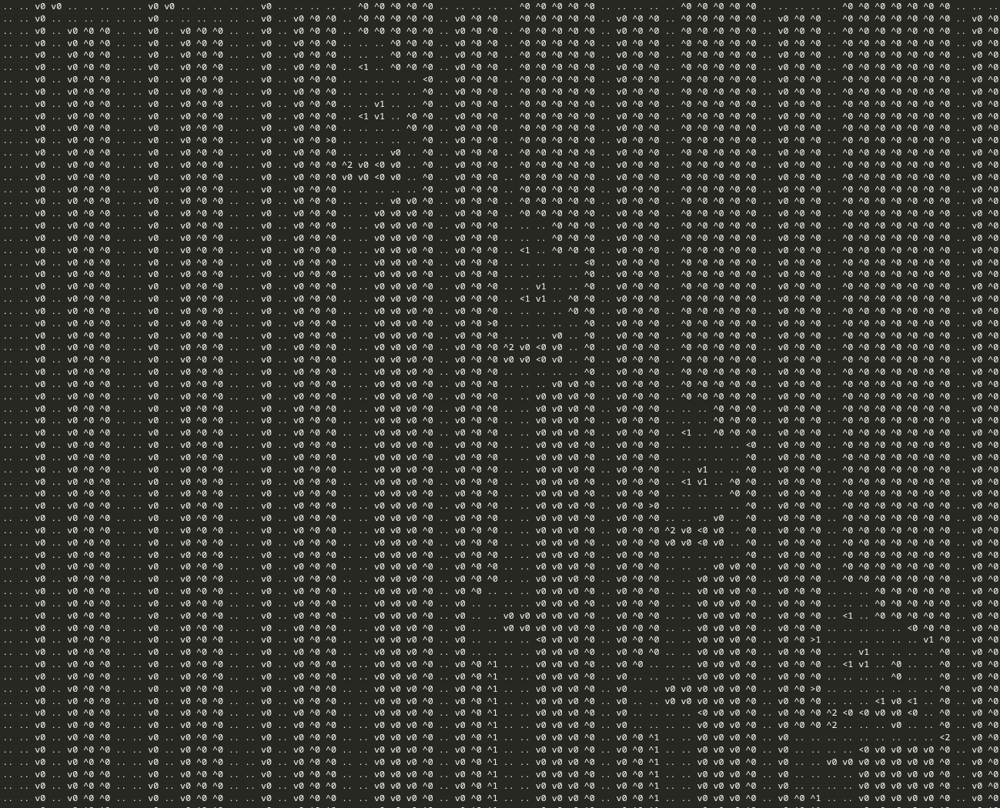

# 問題

ヤジリンというペンパズルの URL が1つ配布されます。また、README にフラグの計算方法が記載されています。

> 1. 解いた盤面の第1行を見る
> 2. 左から順に黒マスを `1`、非黒マスを `0` として連結したバイナリ文字列を作る
> 3. その文字列の SHA-256 ハッシュを計算する
> 4. フラグは `tkbctf{<16進ハッシュ>}` の形式

# 解法

## URL のパース

配布された URL はそのままブラウザで開いたり、curlしても開けません。

puzz.link のヤジリンの URL 形式は `yajilin/<cols>/<rows>/<data>` という構造をしています。
[`pzprjs`の実装](https://github.com/robx/pzprjs/blob/main/src/variety-common/Encode.js)を見ると、`<data>` 部分のエンコーディング規則は以下のようになっています。

- `0`〜`4` の後に続く1文字：矢印付きマス（方向 + 数字）
- `5`〜`9` の後に続く2文字：矢印付きマス（数字が大きい場合）
- `+`：黒マス
- `a`〜`z`：空マスのスキップ（`a` = 1マス飛ばし、`z` = 26マス飛ばし）

これに従ってデコードすると、`cols x rows` のグリッドとして解釈できます。

## グリッドの構造発見

グリッドを可視化すると、横方向に複数の「レーン」が並んだ構造になっていることがわかります。



構造を観察していくと、上下の往復が434回あり、その内最初の16回のみ上部が他と異なった構造を持っていることが確認できます。
更に、17往復目以降、斜めに以下の二種類のパターンが現れています。

```
^0    ^0 ^0 ^0 ^0 ^0
^0    ^0 ^0 ^0 ^0 ^0
^0          ^0 ^0 ^0
^0          ^0 ^0 ^0
^0    <1    ^0 ^0 ^0
^0                <0
^0                ^0
^0       v1       ^0
^0    <1 v1    ^0 ^0
^0             ^0 ^0
>0                ^0
^0          v0    ^0
^0 ^2 v0 <0 v0    ^0
^0 v0 v0 <0 v0    ^0
^0                ^0
^0          v0 v0 ^0
^0       v0 v0 v0 ^0
^0       v0 v0 v0 ^0
```

```
v0 ^0 ^0    ^0 ^0 ^0 ^0 ^0 ^0 ^0
v0 ^0 ^0    ^0 ^0 ^0 ^0 ^0 ^0 ^0
v0 ^0 ^0    ^0 ^0 ^0 ^0 ^0 ^0 ^0
v0 ^0 ^0          ^0 ^0 ^0 ^0 ^0
v0 ^0 ^0          ^0 ^0 ^0 ^0 ^0
v0 ^0 ^0    <1    ^0 ^0 ^0 ^0 ^0
v0 ^0 ^0                <0 ^0 ^0
v0 ^0 >1                   v1 ^0
v0 ^0 ^0       v1             ^0
v0 ^0 ^0    <1 v1    ^0       ^0
v0 ^0 ^0             ^0       ^0
v0 ^0 >0                      ^0
v0 ^0 ^0          <1 v0 <1    ^0
v0 ^0 ^0 ^2 <0 <0 v0 v0 <0    ^0
v0 ^0 ^0 ^2          v0       ^0
v0                            <2
v0             <0 v0 v0 v0 v0 ^0
v0       v0 v0 v0 v0 v0 v0 v0 ^0
v0             v0 v0 v0 v0 v0 ^0
v0             v0 v0 v0 v0 v0 ^0
v0 ^0 ^1       v0 v0 v0 v0 v0 ^0
v0 ^0 ^1       v0 v0 v0 v0 v0 ^0
```

また、これらのパターンの左には必ず以下のようなパターンが2つ存在しています。

```
v0 ^0 ^0       v0 v0
v0 ^0 ^0       v0 v0
v0 ^0          v0 v0
v0             v0 v0
v0       v0 v0 v0 v0
v0       v0 v0 v0 v0
v0             <0 v0
v0             v0 v0
v0 ^0 ^1       v0 v0
v0 ^0 ^1       v0 v0
```

このパターンの組み合わせによって全体が構成されているようです。2つのパターンそれぞれについて最小の構成を抜き出すと、以下のようになります。

[https://puzz.link/p?yajilin/b/24/24/20e2020e20e1010101010f20f20a2...](https://puzz.link/p?yajilin/b/24/24/20e2020e20e1010101010f20f20a201010a1010101010a201010b20a201010b20a201010a1010101010a2010c20a201010b20a201010c101010a20d20a201010b20a201010c101010a20b202020a201010b20a201010a31a101010a20b202020a201010b20a201010e30a20d30a2010c20a201010e10a20d20a20d20a201010b21b10a201011b20a20b202020a201010a3121a1010a201011b20a20b202020a201010d1010a201011b20a20d30a201040e10a201011b20a20d20a201010c20a10a201011b20a201011b20a20101012203020a10a201011b20a201011b20a20101020203020a10a201011b20a201011b20a201010e10a201011b20a201011b20a201010c202010a201011b20a201011b20a201010b20202010a2010c20a2010c20a2010c20202010a2010c20a2010c20a2010c20202010a2010b1020a2010b1020a2010b2020202010a201020d201020d201020g20102010102010201020101020102010202020202020y)

[https://puzz.link/p?yajilin/b/26/27/20e2020e20e10101010101010f20f...](https://puzz.link/p?yajilin/b/26/27/20e2020e20e10101010101010f20f20a201010a10101010101010a201010b20a201010b20a201010a10101010101010a2010c20a201010b20a201010c1010101010a20d20a201010b20a201010c1010101010a20b202020a201010b20a201010a31a1010101010a20b202020a201010b20a201010e301010a20d30a2010c20a201041f2110a20d20a20d20a201010b21d10a201011b20a20b202020a201010a3121a10b10a201011b20a20b202020a201010d10b10a201011b20a20d30a201040g10a201011b20a20d20a201010c312031a10a201011b20a201011b20a201010123030202030a10a201011b20a201011b20a20101012c20b10a201011b20a201011b20a20i32a201011b20a201011b20a20d302020202010a201011b20a201011b20a20b2020202020202010a201011b20a201011b20a20d202020202010a201011b20a201011b20a20d202020202010a201011b20a201011b20a201011b202020202010a2010c20a2010c20a2010c202020202010a2010c20a2010c20a2010c202020202010a2010b1020a2010b1020a2010b20202020202010a201020d201020d201020i201020101020102010201010201020102020202020202020za)

それぞれ解を列挙してみると、最上行の二箇所（2,9列目）の黒マスの有無が`00,01,10,11`の4種類あり、
1つ目のパターンではそれらが`11`の組み合わせの場合に、2つ目のパターンではそれらが`10`または`01`の組み合わせの場合に、
右下の三マス出っ張った部分の一番上のマスが黒マスになっています。このことから、このパターンはそれぞれAND,XORのビット演算を構成しているとわかります。

## 経路の蛇行とビット表現

各レーンでは、経路が横に蛇行しながら下に向かって伸びています。この蛇行には入力ビットによって決まる以下のような2つの「位相」があります。

```
v[x]┏ ┓ ┏ ┓    v ┏ ┓ ┏ ━ ┓
┏ ━ ┛ ┗ ┛ ┃    ┏ ┛ ┗ ┛ ┏ ┛
┃ v ^ ^ ┏ ┛    ┃ v ^ ^ ┗ ┓
┃ v ^ ^ ┗ ┓    ┃ v ^ ^ ┏ ┛
┃ v ^ ^ ┏ ┛    ┃ v ^ ^ ┗ ┓
┃ v ^ ^ ┗ ┓    ┃ v ^ ^ ┏ ┛
```

入力ビットの0と1によって最上行付近の経路が変わり、下に続く部分で蛇行の位相がずれた状態で始まります。この位相は最下行まで保たれたまま伝播していきます。

## 読み出しガジェットとNOT演算

上述した読み出しガジェットはソースレーンの上に重ねて配置され、位相によって異なる位置が黒マスになるように構成されています。

```
v ^ ^ ┏ ┛ v v    v ^ ^ ┗ ┓ v v
v ^ ^ ┗ ┓ v v    v ^ ^ ┏ ┛ v v
v ^ ┏ ┓ ┃ v v    v ^[x]┗ ┓ v v
v ┏ ┛ ┗ ┛ v v    v ┏ ━ ━ ┛ v v
v ┃[x]v v v v    v ┗ ┓ v v v v
v ┗ ┓ v v v v    v ┏ ┛ v v v v
v ┏ ┛ ┏ ┓ < v    v ┃ ┏ ━ ┓ < v
v ┗ ━ ┛ ┃ v v    v ┗ ┛ ┏ ┛ v v
v ^ ^ ┏ ┛ v v    v ^ ^ ┗ ┓ v v
v ^ ^ ┗ ┓ v v    v ^ ^ ┏ ┛ v v
```

この黒マスがAND,XORのガジェットにある`<1`の先に置かれるかどうかによってゲートへの入力ビットが決まり、その組み合わせによってゲートのあるレーンの以降の位相が決まります。

上の図で`[x]`の位置を比較すると、左では5行目に、右では3行目に黒マスが来ており、この上寄り/下寄りの違いはビット値そのものではなく反転の有無に対応しています。

NOTは二通りの方法で表現されています。

### 読み出しガジェットの位置
ガジェット全体が2行だけ上にずれると、経路はそのままにAND/XORガジェットによって読み出される黒マスの行が3行目から5行目に変わります。これにより読み出される値が反転します。

### AND/XORガジェットの配置行の偶奇
蛇行は2行周期なので、ガジェット全体を1行ずらすと位相が半周期ずれ、読み出しガジェットを通る経路が変わり、読み出される値が反転します。

盤面を解析する際はこの二つをそれぞれ読み取り、XORをとることでNOTフラグを復元できます。

最終的に評価される値は一番右のレーンの出力です。最後のレーンの最下行は以下のようになっており、これはレーンの出力が1の場合にのみ成立します。

```
^0 ^0       v0 v0 v0 ^0
>1          v0         
^0          v0         
^0       v0 >0         
^0 v0                v0
^0 v0 v0 v0 v0 v0    v0
                     v0
```

ここまでの解析により、盤面全体を回路としてパースすることができます。入力は16bitなので、2^16通りのすべての入力に対して出力を計算する、またはz3ソルバーなどを使って出力が1になる入力を計算することで`1100000110110101`という解が得られます。
入力の各bitが最上行の$7x+2$列目に対応していることから、以下のようにしてフラグが計算できます。

```python
bits = "1100000110110101"
width = 4548
val = bytearray(b"0"*width)
for i in range(16):
    val[i*7+1] = ord(bits[i])
print(f"tkbctf{{{hashlib.sha256(val).hexdigest()}}}")
```

Google CTFで毎年出題される論理回路問が好きなのでインスパイアです。
この問題は人力で解いてもらう気はあんまりなく、うまくAIと協働してねという意図で作りました。
URLのパースなどはAIに任せて、人間は構造の把握に集中するのが良いと思います。
