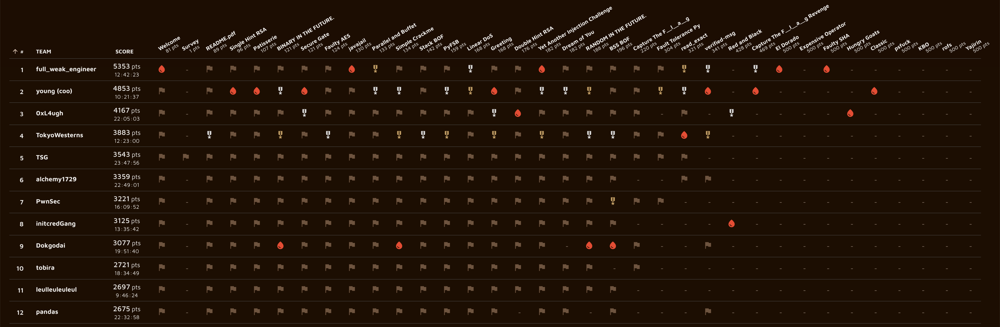

2026年3月14日から15日にかけてtkbctf5というCTFを開催しました。

構想は1年ほど前にkeymoonさんとラーメン屋に行く道中で話していたところから始まりました。TPCの中で声を掛け、最終的に7人のチームで作問・運営をしました。
organizerはTPCなのでTPC CTFかなと思っていたんですが、筑波大学には2014年まで4回開催されていたtkbctfというCTFがあり、復活させたら面白いんじゃないかという話になり、tkbctf5という名前になりました。
快く名前を使わせていただいた旧tkbctfのorganizerチームの皆様にはこの場を借りて改めてお礼申し上げます。

結果として、185チームに参加（1ポイント以上を獲得したチーム）していただきました。

コンテスト開催前はどうなることかとヒヤヒヤしていましたが、各分野ボス問は2solves以下となり、その他の問題も含めて想像以上にAI・人類両方に苦戦して頂けたようでした。
フィードバックも概ね好評で、死にそうになりながら運営した甲斐がありました。

CTFとAIの情勢や問題ストックの関係で来年以降開催できるかは一切分かりませんが、開催できるようであればtkbctf6も続けて開催したいと思います。

# コンテストサイトについて

コンテストサイトとして、keymoonらが運営しているAlpacaHackを使わせていただくことになりました。AlpacaHackでやったらおもろいやろというのと、終了後の常設化がやりやすいこと、インフラ周りを見知っており扱いやすいであろうことなどが理由です。
前々からチーム戦機能はあると良いよねという話だったらしく、これを機にAlpacaHackにチーム戦機能を実装することになりました。
しかしダラダラと後回しにしていった結果、一週間前から機能開発を始め、コンテストページを公開したのは開催3日前とかなりギリギリになってしまいました。

# スポンサーについて

SECCONの時にFlatt Security様からスポンサーに前向きなお話をいただいたんですが、送金が面倒そうなこと、賞金目的で参加するチームはそう多くなさそうなことから、賞金なしで開催することにしました。
しかしよく考えると、SECCON 14の優勝などもあり国内ではそれなりに名前の知れたチームになっているものの、海外から見ると賞金もなく前回開催が12年前の謎のCTFがまともだとは誰も思わないと思います。

# CTFとAIについての話

昨今AIのCTF力が急速に上がっており、周りでもCTFは終わりだみたいな話題がよく上がるようになってきました。
競技プログラミングはAIを禁止することで存続する道に進んでいくことができていそうですが、やはりCTFは競技の性質上AIを禁止するということでコミュニティ全体の合意を取ることは不可能だろうと思います。

今回私が作問したいくつかの問題、特にYajirinは、AIだけではまず解けない一方で人類だけで解くのも24時間ではかなり難しく、AIと上手く協働してください、というのが想定した解き筋でした。
この問題が誰にも解かれなかったことは、（単純に取り組んだプレイヤーが少なかったのも原因の一つだとは思いますが）AIを使いこなすというのが競技として成立する程度に難しいことの証左になったのではないかと思います。
この問題程度であれば今後1年もあればAIでoneshotできるようになるかもしれませんが、その時になってもAIに丸投げするのとAIを使いこなすので出力に差が生まれることは変わらないと思っています。
ただ、「使いこなす」というのが具体的に何なのかはまだ私にはよくわかりません。誰か教えてください。

CTFの競技としての側面が失われてもCTFというコンテンツの面白さは失われていません。娯楽としてのCTFはむしろAIがなんでも解説してくれることによってより面白くなっているのではないでしょうか？
Daily AlpacaHackがまさに娯楽としてのCTFの面白さを得ることに特化したコンテンツであり、私も毎日楽しみにしています。こういうのが増えていくといいなと思います。

とにかく、私はもう少しCTFを続けていくつもりです。

# 作問した問題

私はcryptoを7問、reversingを2問、webを1問、miscを3問、rev-miscを1問作問しました。
cryptoはコツコツ貯めていた作問ストックからある程度バランスをみて出題したつもりですが、後半に変に大変な問題が多くなってしまったような認識はあります。
本当はペアリングとかのガッツリ数学な高難易度の問題を出したかったところですが、数学力が足りませんでした。精進します。

以下、私の作問した問題の解説になります。
